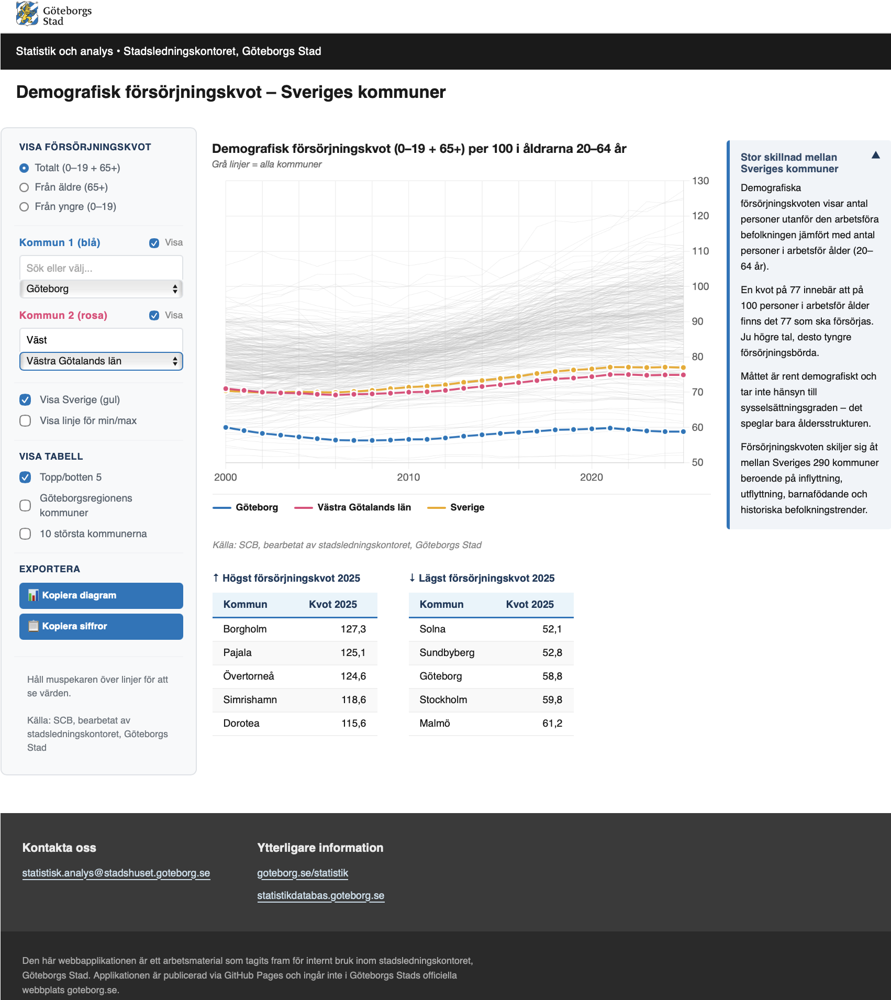

# Demografisk försörjningskvot – Sveriges kommuner

Interaktiv webbapplikation för analys av demografisk försörjningskvot i Sveriges kommuner, framtagen inom stadsledningskontoret, Göteborgs Stad.



## Om applikationen

Applikationen visar hur den demografiska försörjningskvoten skiljer sig åt mellan Sveriges kommuner under perioden 2000–2025. Måttet visar hur många personer som befinner sig utanför arbetsför ålder (0–19 år och 65+) per 100 personer i arbetsför ålder (20–64 år) – ett rent demografiskt mått som inte tar hänsyn till faktisk sysselsättning.

Tre mått kan väljas:
- **Totalt** – summan av barn och äldre
- **Från äldre** – personer 65 år och äldre
- **Från yngre** – personer 0–19 år

Längst ner i kommunlistan finns även Sveriges 21 län, som kan väljas och jämföras på samma sätt som kommuner.

## Arbetsflöde

Data hämtas direkt från SCB:s statistikdatabas via API med R-paketet `pxweb`. När ny statistik finns tillgänglig (normalt varje år) körs datahämtningen om och applikationen renderas på nytt.

```
hamta_data.R          → data/forsorjningskvot.json
quarto render         → docs/index.html
git push origin main  → publiceras på GitHub Pages
```

### Uppdatera med nytt statistikår

```r
# 1. Hämta ny data från SCB
source("hamta_data.R")

# 2. Rendera HTML
# I Terminal:
# quarto render index.qmd --to html

# 3. Pusha till GitHub
# git add .
# git commit -m "Uppdatering statistik ÅÅÅÅ"
# git push origin main
```

## Filer

| Fil | Beskrivning |
|-----|-------------|
| `hamta_data.R` | Hämtar data från SCB API och exporterar till JSON |
| `index.qmd` | Quarto-fil som renderar HTML-applikationen |
| `styles.css` | Stilmall enligt Göteborgs Stads grafiska profil |
| `_quarto.yml` | Quarto-projektkonfiguration |
| `gbg_li_rgb.svg` | Göteborgs Stads logotyp |
| `data/` | Genererad JSON-data (skapas av hamta_data.R) |
| `docs/` | Renderad HTML som publiceras via GitHub Pages |

## Teknisk stack

- **R + pxweb** – datahämtning från SCB API
- **Quarto** – dokumentformat och rendering
- **Chart.js** – interaktiva diagram
- **GitHub Pages** – publicering

## OBS

Detta är ett arbetsmaterial för internt bruk inom stadsledningskontoret, Göteborgs Stad. Applikationen publiceras via GitHub Pages och ingår inte i Göteborgs Stads officiella webbplats goteborg.se.
